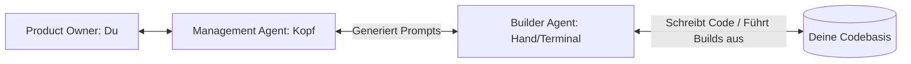
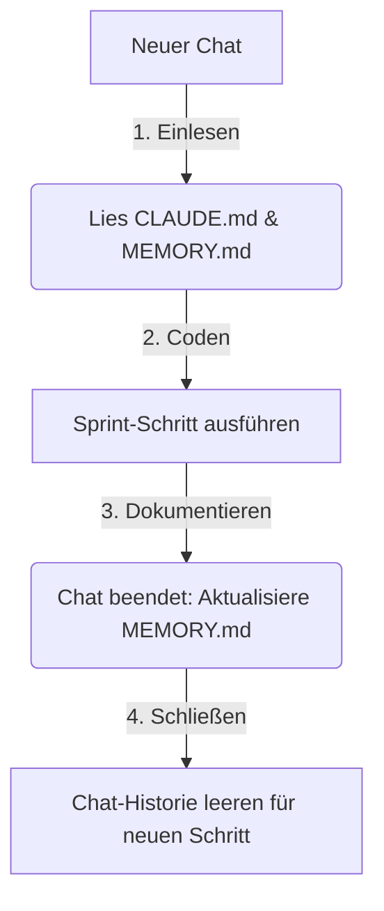

# Das Dual-Agent-Sprint-Framework: Effizientes Bauen mit KI

Dieses Dokument beschreibt eine standardisierte Methodik, um als Product Owner (Du) mithilfe eines **Management-Agents** (Planung, Architektur, Qualitätssicherung) und eines **Builder-Agents** (Claude Code - Ausführung, Lints, Terminal) komplexe Softwareprojekte fehlerfrei und in Rekordzeit zu bauen.

---

## 1. Die Rollenverteilung



* **1. Product Owner (Du):** 
  - Definiert die Vision ("Was soll die App können?").
  - Testet die Features im Browser und gibt Feedback.
  - Steuert die Freigaben (Gates).
* **2. Management-Agent (Der Architekt - z. B. Antigravity):**
  - Analysiert die Code-Struktur global (Vogelperspektive).
  - Identifiziert architektonische Risiken (Datenlecks, API-Kosten, Performance).
  - Zerlegt große Sprints in logische, überschneidungsfreie Teilschritte (Slices).
  - Schreibt **präzise, isolierte Prompts** für den Builder-Agent.
* **3. Builder-Agent (Der Entwickler - z. B. Claude Code):**
  - Arbeitet direkt auf dem lokalen Dateisystem.
  - Schreibt, bearbeitet und löscht Code.
  - Führt Terminal-Befehle aus (`npm run build`, `npm run dev`, `git status`).
  - Behebt selbstständig Compiler- und Lint-Fehler vor dem Abschluss.

---

## 2. Der 5-Phasen-Sprint-Prozess

Um Sprints standardisiert durchzuführen, folge immer diesem Ablauf:

### Phase 1: Brainstorming & Zieldefinition (Management-Chat)
- Diskutiere mit dem Management-Agent dein Ziel in einfacher Sprache.
- Klärt Fragen wie: *"Macht das Sinn?"*, *"Was sind die Kosten?"*, *"Welches UI fühlt sich am besten an?"*

### Phase 2: Technische Lückenanalyse (Gap-Analysis)
- Der Management-Agent scannt das Repo und listet auf:
  - Was ist bereits da?
  - Was fehlt (Technisch, Sicherheitsrelevant, Rechtlich)?
  - Was darf **auf keinen Fall** verändert oder beschädigt werden (Constraints)?

### Phase 3: Dependency-Mapping & Sprint-Planung
- Der Sprint wird in Einzelschritte zerlegt. 
- Bestimmung von **Sequentiellen Aufgaben** (z. B. Datenbanktabellen müssen vor API-Routen existieren) und **Parallelen Aufgaben** (z. B. Admin-Interface und User-Dashboard können gleichzeitig in 2 Fenstern gebaut werden).

### Phase 4: Iterative Ausführung ("Prompt-by-Prompt")
- Du kopierst **immer nur einen Prompt auf einmal** in den Builder-Agent (Claude Code).
- **Wichtig:** Der Builder-Agent muss am Ende jedes Prompts einen Build-Check (`npm run build`) durchführen.
- Du gibst das Ergebnis (Erfolg/Fehlermeldung) zurück an den Management-Agent. Erst nach dessen Freigabe holst du den nächsten Prompt.

### Phase 5: Test & Release
- Manueller Test der definierten Use-Cases.
- Git Commit & Deploy.

---

## 3. Das standardisierte Prompt-Template für den Builder-Agent

Damit der Builder-Agent (Claude Code) exakt das tut, was er soll, ohne Code zu zerstören oder abzuschweifen, nutzt der Management-Agent immer dieses Template für seine Prompt-Generierung:

```text
[Sprint-Schritt X/Y]: [Kurzer Titel]

KONTEXT:
- Aktueller Zustand im Repo: [z. B. Welche Dateien existieren, welche Bibliotheken sind da]
- Wichtig: [Zusammenhang zum vorherigen Schritt]

CONSTRAINTS (EINSCHRÄNKUNGEN):
- Verändere NICHT [z. B. die Kartengenerierung, den FSRS-Algorithmus o.ä.]
- Nutze ausschließlich [z. B. Tailwind-Klassen, vorhandene Komponenten]

AUFGABEN:
1. [Präzise Aufgabe 1]
2. [Präzise Aufgabe 2]
3. [Präzise Aufgabe 3]

VERIFIKATION:
- Führe nach Abschluss aller Änderungen einen Build-Check durch (z. B. 'npm run build' oder 'npx tsc --noEmit').
- Behebe alle TypeScript-, Lint- oder Compiler-Fehler selbstständig.
- Liste am Ende alle neu erstellten oder geänderten Dateien auf.
```

---

## 4. Kontext- & Gedächtnis-Management (Tokens & Kosten sparen)

Um zu verhindern, dass die KI bei langen Chats den Faden verliert oder unnötig hohe API-Kosten durch riesige Chatverläufe entstehen, nutzen wir ein **externes Gedächtnis** direkt in deinem Projektordner.

### Die zwei zentralen Gedächtnis-Dateien:
1. **`CLAUDE.md` (Das technische Regelwerk):**
   - Enthält die Befehle zum Starten/Bauen/Testen der App und die Programmierrichtlinien (z. B. *"Verwende Tailwind", "Keine 'any' Typen"*).
   - *Vorteil:* Claude Code liest diese Datei bei jedem Start automatisch im Hintergrund ein.
2. **`MEMORY.md` (Das Projektgedächtnis - neu anlegen):**
   - Enthält das aktuelle Supabase-Datenbankschema (Tabellen & Felder), die Struktur der API-Routen und den aktuellen Stand der Features.

### Der Workflow für das Gedächtnis-Update:



1. **Beim Start eines neuen Chats (Bootstrapping):**
   Gib der KI als allererste Nachricht immer diesen Befehl:
   > *"Lies die `CLAUDE.md` und `MEMORY.md` im Projektordner ein, um den aktuellen Architekturstand, das Datenbankschema und die Entwicklungs-Richtlinien zu verstehen. Antworte nur mit 'Bereit', wenn du alles verstanden hast."*
2. **Am Ende eines Arbeitsschritts (Update):**
   Bevor du den Chat schließt, sagst du dem Agenten:
   > *"Aktualisiere die `MEMORY.md` im Projektordner, um die neuen Änderungen (Datenbanktabellen, geänderte API-Routen, etc.) zu dokumentieren."*
3. **Chat schließen:** Starte den nächsten Schritt mit einem frischen, kostengünstigen Chat.

