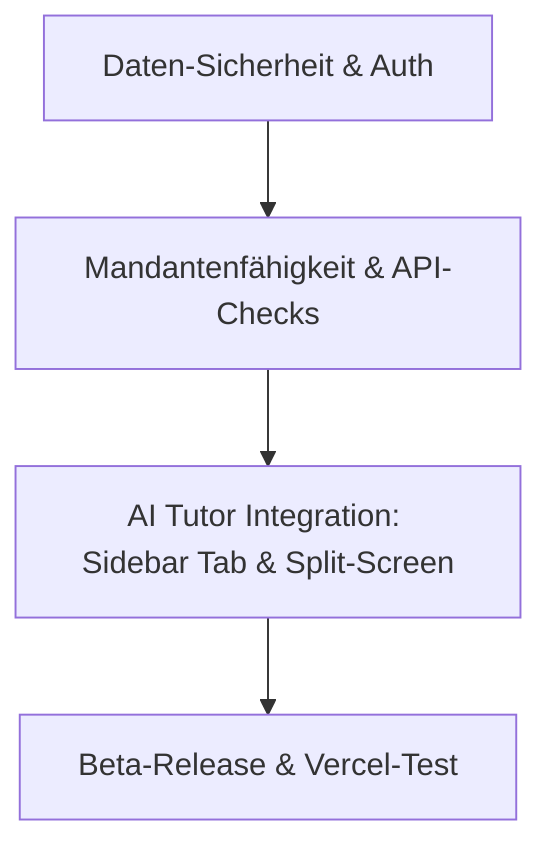

# Roadmap: Private Beta, Multi-User & AI Tutor Integration

## 📌 Kurz & Einfach: Was wir hier vorhaben
Aktuell ist deine App wie ein Haus ohne Haustür – jeder, der die URL hat, kommt rein und alle teilen sich denselben Inhalt. Wir bauen nun ein sicheres Mehrfamilienhaus daraus:
1. **Die Haustür (Login):** Wir erstellen eine Anmeldeseite. Nur wer registriert ist, darf die App nutzen.
2. **Die eigenen Wohnungen (Daten-Trennung):** Wir richten die Datenbank so ein, dass jeder Nutzer nur noch seine eigenen Kurse und Karteikarten sieht. Niemand kann die Daten anderer einsehen oder löschen.
3. **Der persönliche Tutor (AI Tutor Tab):** Wir bauen einen neuen Bereich in die linke Seitenleiste ein. Links ist ein Chat für Fragen zu deinen Decks, rechts gibt es tägliche Motivation.
4. **Das Kennenlernen (Onboarding):** Neue Nutzer werden einmalig von der KI begrüßt, die kurz nach dem Studienfach fragt, um die App zu personalisieren.

---

Dieses Dokument beschreibt den schrittweisen Fahrplan, um die App von einer Single-User-Anwendung in eine sichere **Private Beta für Freunde** zu verwandeln und einen personalisierten **AI Tutor-Bereich** zu integrieren.

---

## 1. Übersicht der Meilensteine



### API-Kosten-Einschätzung für den AI Tutor:
* **Motivation-Tab:** Wird nur beim Laden des Tabs ausgeführt (kann für den Tag im Session-State gecached werden). Kosten pro Aufruf: **~0,1 Cent** (Claude 3.5 Haiku).
* **Hilfe-Tab (Chat):** Reagiert nur bei Benutzereingaben. Kosten pro Nachricht (inkl. Deck-Kontext): **~0,2 bis 0,3 Cent**.
* **Fazit:** Absolut vernachlässigbar und extrem kosteneffizient.

---

## 2. Schritt-für-Schritt-Fahrplan & Prompts für Claude Code

Führe diese Schritte nacheinander in deinem Claude Code Terminal aus. Passe die Prompts bei Bedarf an deine genauen Wünsche an.

---

### Schritt 1: Supabase Auth & Route-Schutz (Tag 1)

Wir richten die E-Mail-Registrierung ein und schützen die App-Routen, sodass nicht angemeldete Nutzer umgeleitet werden.

#### 📝 Prompt für Claude Code:
```text
Erstelle ein Authentifizierungs-System für Next.js App Router mit Supabase:
1. Verwende @supabase/ssr für Server-Komponenten und Route-Handler.
2. Erstelle eine Login- und Registrierungs-Seite unter app/(auth)/login/page.tsx und app/(auth)/signup/page.tsx mit einem modernen, minimalistischen Design (passend zur App-Identität).
3. Erstelle eine middleware.ts im Projekt-Root, die alle Routen unter app/(app)/* schützt. Nicht eingeloggte User müssen zu /login umgeleitet werden. Eingeloggte User dürfen die App normal nutzen.
4. Aktualisiere lib/supabase.ts oder erstelle Hilfsfunktionen für server-seitige Supabase-Clients (createRouteHandlerClient, createServerComponentClient), damit die Authentifizierung auf Server-Ebene greift.
5. Führe einen Build-Check durch, um sicherzustellen, dass keine Compile-Fehler entstehen.
```

---

### Schritt 2: Daten-Trennung (user_id) & RLS (Tag 2)

Jeder Nutzer darf nur seine eigenen Kurse, Themen und Daten sehen.

#### 📝 Prompt für Claude Code:
```text
Implementiere die Daten-Trennung (Multi-User-Sicherheit) auf Datenbank- und API-Ebene:
1. Füge gedanklich das Feld user_id (UUID) zur Tabelle "kurs" hinzu. (Falls SQL-Migrationen im Repo liegen, erstelle ein entsprechendes Migrations-File).
2. Verknüpfe auch die Tabellen api_usage, generier_profil, lern_streak, deck_feedback und session_results mit einer user_id (UUID).
3. Überarbeite alle API-Routen unter app/api/ (insbesondere kurse, themen, karten, karte/[id], streak, generier-profil, kosten, feedback), sodass sie supabase.auth.getUser() abfragen und nur Datensätze filtern/bearbeiten, die der user_id des eingeloggten Users entsprechen.
4. Stelle sicher, dass bei der Kartengenerierung (generieren/route.ts) geprüft wird, ob das Thema dem eingeloggten User gehört (Ownership-Check), um Missbrauch zu verhindern.
5. Schreibe die SQL-Befehle auf, um Row Level Security (RLS) für alle Tabellen in Supabase zu aktivieren, sodass RLS-Regeln (auth.uid() = user_id) erzwungen werden.
```

---

### Schritt 3: Der "AI Tutor"-Tab in der Sidebar (Tag 3)

Wir fügen den neuen Tab in der Sidebar hinzu und bauen den Split-Screen-Bereich (Hilfe & Motivation).

#### 📝 Prompt für Claude Code:
```text
Erstelle einen neuen Bereich für den "AI Tutor":
1. Füge in der Sidebar (unter Statistik) einen neuen Menüpunkt "AI Tutor" (mit einem passenden Icon, z. B. Sparkles oder Brain) hinzu, der auf /tutor verweist.
2. Erstelle die Seite app/(app)/tutor/page.tsx als modernen Split-Screen (zwei Spalten auf Desktop, gestapelt auf Mobile):
   - Linke Spalte: "Hilfe & Fragen". Ein interaktives Chatbot-Interface. Hier kann der User dem Tutor Fragen zu seinen Lernmaterialien stellen.
   - Rechte Spalte: "Motivation & Status". Ein Bereich, in dem der KI-Tutor eine personalisierte Motivationsnachricht anzeigt (basierend auf der aktuellen Lern-Streak des Users, den letzten fälligen Karten und dem Fachgebiet).
3. Erstelle eine API-Route app/api/chat/route.ts, die Anfragen an die Anthropic-API (Claude Haiku) leitet. Die Route soll das generier_profil des Users sowie den Namen des aktuellen Themas/Kurses auslesen, um dem Tutor Kontext zu geben.
4. Füge auf der Seite eine Lade-Animation hinzu, während der Motivations-Spruch geladen wird. Coche das Ergebnis für die Session, damit nicht bei jedem Klick API-Kosten entstehen.
```

---

### Schritt 4: Das Onboarding (Tag 3)

Einmalige Begrüßung für neue User zur Erfassung des Fachgebiets.

#### 📝 Prompt für Claude Code:
```text
Erstelle ein personalisiertes User-Onboarding:
1. Prüfe in der User-Datenbank (z. B. Tabelle generier_profil oder profiles), ob für den User onboarding_completed auf false steht.
2. Falls false, zeige beim ersten Laden des Dashboards ein elegantes Willkommens-Modal (Onboarding-Wizard) an.
3. Der AI Tutor begrüßt den Nutzer freundlich und erfasst in 2-3 einfachen Fragen: Fachbereich/Studienfach, das wichtigste Lernziel und das zeitliche Lernfenster (z. B. "Sehr gestresst", "Normal", "Entspannt").
4. Speichere diese Daten im generier_profil des Users und setze onboarding_completed: true.
5. Stelle sicher, dass das Onboarding danach nie wieder erscheint.
```
