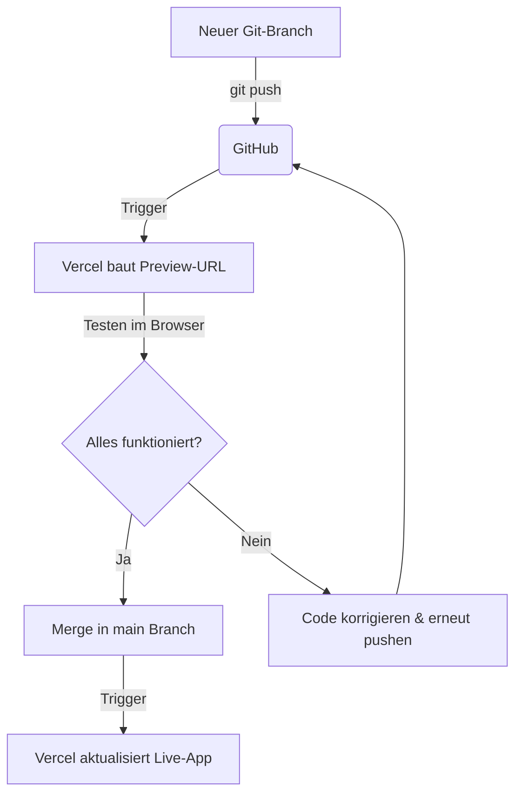

# Vercel Preview-Workflow: Cloud-Bauen ohne Localhost

Wenn du auf einem Gerät mit begrenztem Arbeitsspeicher (wie einem M1 Mac mit 8 GB RAM) arbeitest, können lokale Next.js-Entwicklungsserver (`npm run dev`) deinen Rechner schnell zum Abstürzen bringen.

Der **Vercel Preview-Workflow** verlagert das Bauen und Testen komplett in die Cloud. Du brauchst keinen lokalen Server mehr.

---

## 1. Wie Preview-Deployments funktionieren



1. **Isolierter Branch:** Du arbeitest nicht auf `main`, sondern erstellst einen neuen Zweig (Branch) für dein Feature (z. B. `feat/auth`).
2. **Automatischer Build:** Sobald du diesen Branch zu GitHub pushst, baut Vercel eine eigene, isolierte Version deiner App.
3. **Eigene URL:** Vercel gibt dir eine eindeutige "Preview-URL" (z. B. `anki-factory-git-feat-auth.vercel.app`).
4. **Keine Auswirkung auf Live-App:** Deine Hauptseite (Production) bleibt für dich und deine Freunde komplett unberührt und stabil, während du auf der Preview-URL testest.

---

## 2. Der Schritt-für-Schritt-Workflow im Terminal

Nutze diese Befehle in deinem Terminal (oder lass sie von Claude Code ausführen), um Features sicher in der Cloud zu testen:

### Schritt 1: Neuen Branch erstellen
Bevor du ein neues Feature baust, erstelle einen neuen Branch:
```bash
git checkout -b feat/mein-neues-feature
```

### Schritt 2: Änderungen vornehmen & commiten
Lass den Code-Agenten arbeiten. Wenn ein Schritt fertig ist, sichere ihn lokal:
```bash
git add .
git commit -m "feat: beschreibung der änderung"
```

### Schritt 3: In die Cloud pushen (Vercel-Build starten)
Pushe den Branch zu GitHub:
```bash
git push origin feat/mein-neues-feature
```
*Vercel startet jetzt sofort im Hintergrund den Build und stellt dir in deinem Vercel-Dashboard die Preview-URL bereit.*

### Schritt 4: Testen & Korrigieren
- Öffne die Preview-URL auf deinem Handy oder Laptop und teste das neue Feature.
- Wenn ein Bug auftritt: Ändere den Code lokal, mache einen neuen Commit und pushe erneut. Vercel aktualisiert die Preview-URL automatisch.

### Schritt 5: In die Live-App übernehmen (Merge)
Wenn alles perfekt funktioniert, merge den Code in den Hauptzweig:
```bash
# Zurück zum Hauptbranch wechseln
git checkout main

# Änderungen aus dem Feature-Branch hineinziehen
git merge feat/mein-neues-feature

# Live-App auf Vercel aktualisieren
git push origin main

# Den alten Feature-Branch lokal löschen (Aufräumen)
git branch -d feat/mein-neues-feature
```
